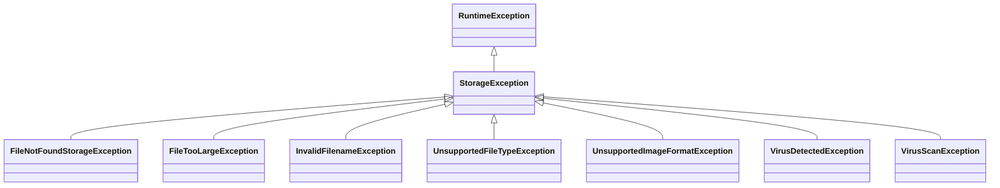

# Storage Exception Package (`com.project.souklab.filestorage.exception`)

Exception taxonomy for storage failures, virus detection, and validation errors.

---

## Exception Hierarchy

---

## Classes Reference

| Exception Class | HTTP Status | Error Code | Trigger Condition |
| :--- | :---: | :--- | :--- |
| [`StorageException`](StorageException.java) | `500` / Variable | `STORAGE_ERROR` | Base exception decoupled from `AppException`. |
| [`FileNotFoundStorageException`](FileNotFoundStorageException.java) | `404 Not Found` | `FILE_NOT_FOUND` | Target object key does not exist in bucket. |
| [`FileTooLargeException`](FileTooLargeException.java) | `400 Bad Request` | `FILE_TOO_LARGE` | File exceeds maximum permitted upload byte size. |
| [`InvalidFilenameException`](InvalidFilenameException.java) | `400 Bad Request` | `INVALID_FILENAME` | Path traversal (`..`) or invalid characters in filename. |
| [`UnsupportedFileTypeException`](UnsupportedFileTypeException.java) | `415 Unsupported` | `UNSUPPORTED_FILE_TYPE` | MIME type not present on allowlist. |
| [`UnsupportedImageFormatException`](UnsupportedImageFormatException.java) | `400 Bad Request` | `UNSUPPORTED_IMAGE_FORMAT` | Magic bytes do not match declared image type. |
| [`VirusDetectedException`](VirusDetectedException.java) | `400 Bad Request` | `VIRUS_DETECTED` | ClamAV detected malicious virus signatures in payload. |
| [`VirusScanException`](VirusScanException.java) | `503 Service Unavailable` | `VIRUS_SCAN_ERROR` | Antivirus daemon connection failed or timed out. |
